<!-- _class: lead -->

# intent-vfx
## Part One
### Describing Assets & Scenes in OpenUSD for VFX Pipelines

- A guide to **one** possible way to structure USD assets & scenes for VFX
- Meant to be **adapted** — expect to change the file/folder layout first

---

## VFX Workflow Requirements — Overview

1. **Layered** department contributions (non-destructive)
2. **Granularity** — per-shape shading & geometry
3. **Scriptability** — built via the OpenUSD API
4. **Instancing** — explicit + implicit
5. **Scalability** — purposes, representations, LODs
6. **Type & Kind** hierarchy
7. **Files & folders** structure

---

## Requirement: Layered, Non-Destructive Contributions

- Multiple departments contribute via **layered opinions**
- Non-destructive: no department overwrites another's work
- Realized with sublayers and composition arcs

---

## Requirements: Granularity & Scriptability

**Granularity**
- Per-shape shading and geometric opinions

**Scriptability**
- Everything built/edited via OpenUSD API (`Sdf`, `Usd`, `UsdGeom`, `UsdShade`)
- The majority of the project is scripts

---

## Requirements: Instancing & Scalability

**Instancing**
- Explicit (`PointInstancer`) + implicit (native `instanceable`)
- Apply edits via **composition arcs** while *retaining* instanceability

**Scalability**
- `purpose`, alternative representations / LODs
- Future: variant-based alternative layouts

---

## Requirements: Type/Kind & File Structure

**Type + Kind hierarchy**
- Simple but useful -> better interrogability & usability

**Files & folders**
- Simple, shareable layout (textures, materials reused across assets)
- Pipeline-specific — customize this!

---

## Asset Generation

- Two near-identical build scripts: `simpleAsset` and `teapot`
- `simpleAsset`: `proxy` = cube, `render` = sphere
- `teapot`: `default` purpose only

```bash
cd assets/teapot   && python ../../build_teapot.py
cd assets/simpleAsset && python ../../build_simpleAsset.py
```

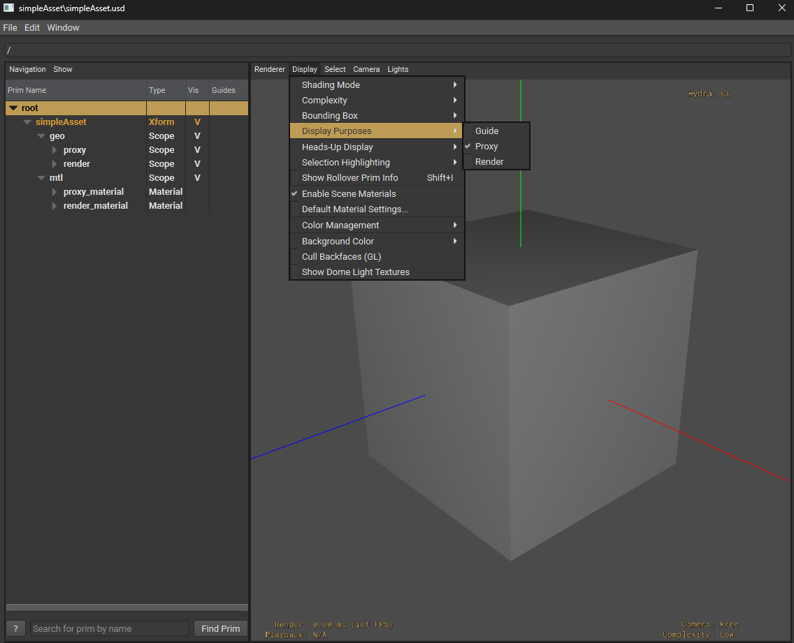 

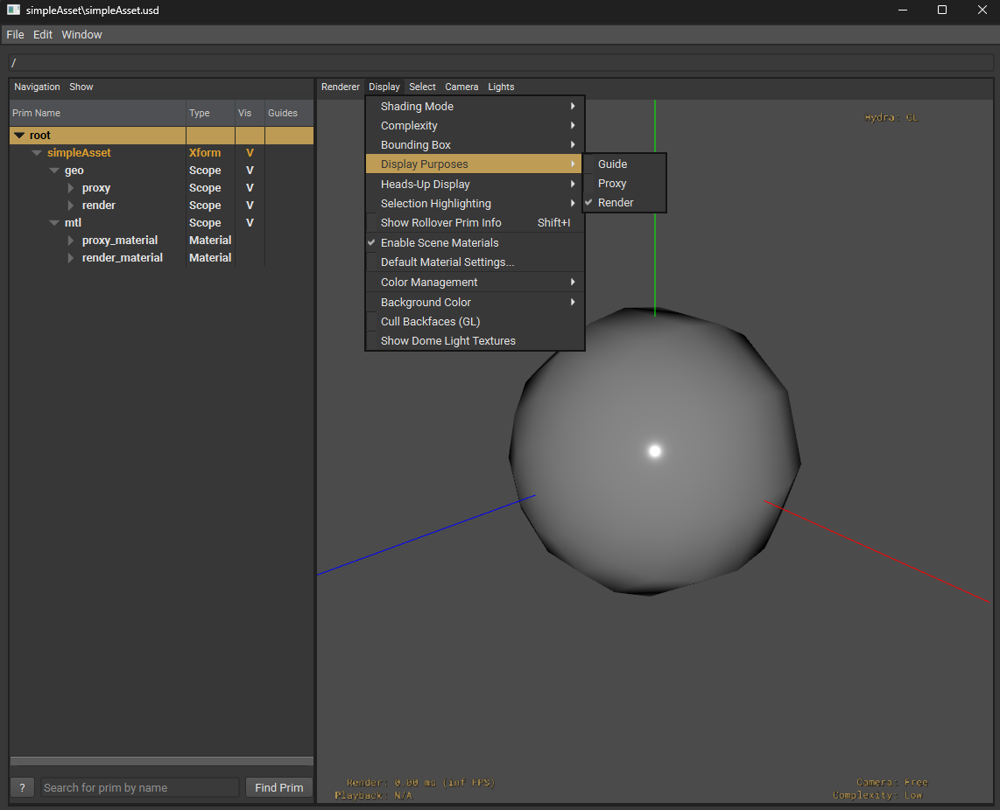

---

## Asset-Level Animation Cycles

- `build_teapot_animcycle.py` creates an override for the `points`
- Asset-specific cycle -> **reusable across a scene with time offsets**
- Produces `teapot_animCycle.usd` alongside `teapot.usd`

```bash
cd assets/teapot && python ../../build_teapot_animcycle.py
```

---

## Layout Generation

- Concentric-ring distribution
- Each ring randomly uses **PointInstancers or native-instancing**
- Key result: only **one implicit prototype**, shared across all elements + PI prototypes

```bash
cd scenes && python ../build_scene_teapot_layout.py
```

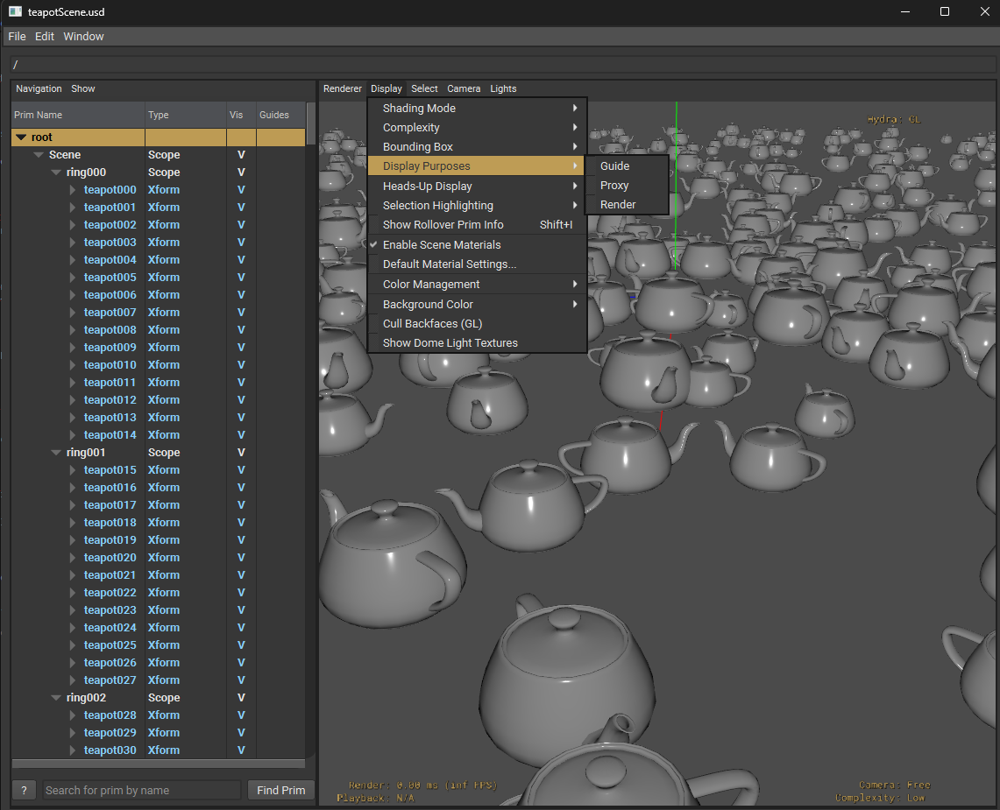

---

## Material & Geometry Overrides — Overview

- New layer over `teapotScene` with **controlled** implicit-prototype creation
- Each override set -> an abstract prim (**class**) inherited onto elements & PointInstancers

```bash
cd scenes && python ../build_scene_teapot_layout_overrides.py
```

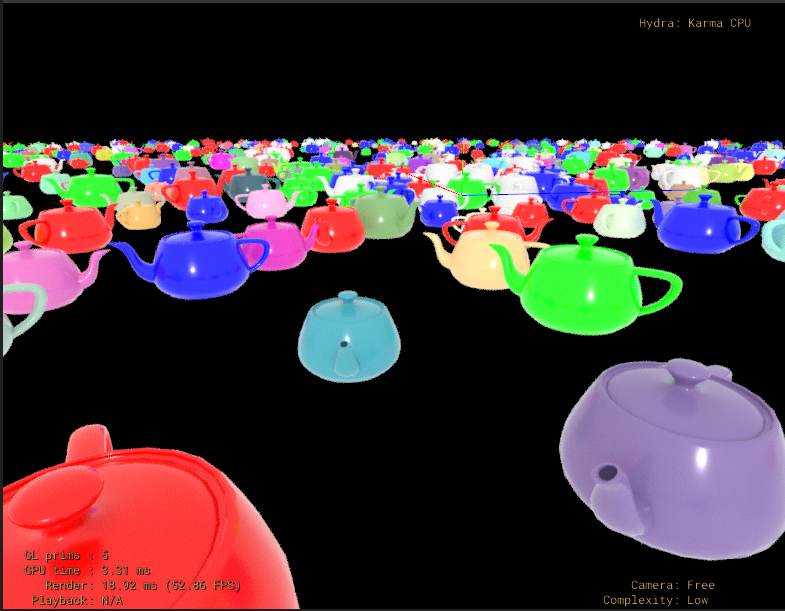

---

## Override Technique 1: Input Parameter Override

- 3 classes overriding `inputs:base_color` → red / green / blue
- Inherited randomly onto individual elements (`instanceable` on)
- Added as explicit prototypes on some PointInstancers + `protoIndices` overridden

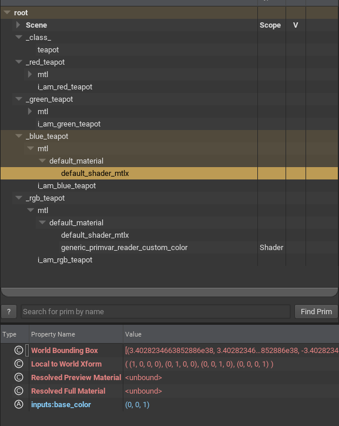 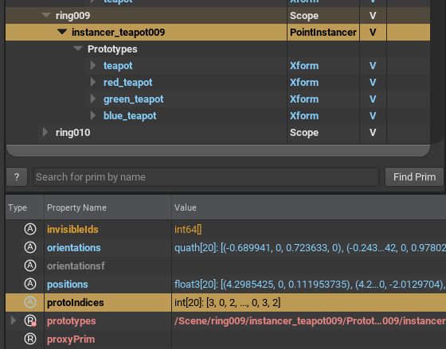

---

## Override Technique 2: Per-Instance Primvars

- `rgb_teapot` class connects `base_color` → a shader reading primvar `custom_color`
- Same material reused across PointInstancers → per-instance color variation
- Colors are now **variations, not new prototypes**
- Renderer must support per-instance primvars

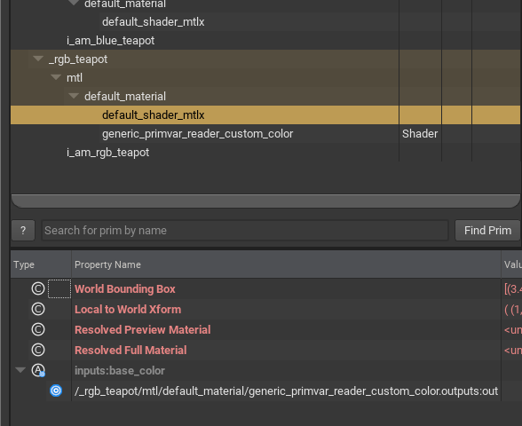 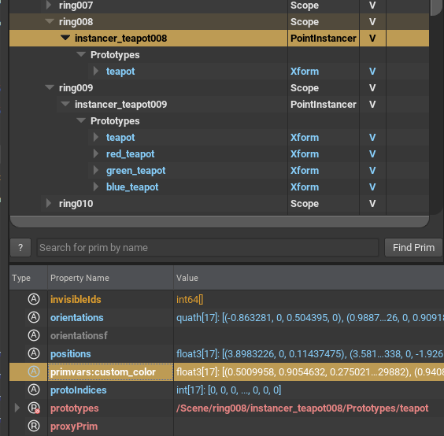

---

## Understanding Implicit Prototypes — The Label Trick

- New composition arc -> USD computes new implicit prototypes
- Trick: empty **named prim** in each class -> visible in the outliner
- Lets you trace between prototypes and classes

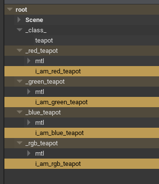 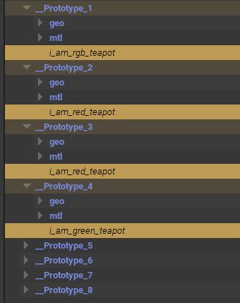

---

## A Known Wrinkle (Good Exercise!)

- Result: **two** implicit prototypes per colored override
  - one for native-instanced elements
  - one for PointInstancer prototypes
- Left as an exercise to restructure and "solve"

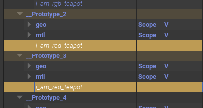

---

## VFX Intent - Part Two
## OpenUSD Concepts

*"A stage is the composed result of many layered opinions;
The VFX intent is one disciplined way of stacking those opinions."*

---

## Prims, Properties, Opinions

- **Prim** = a node in the namespace hierarchy (a path like `/World/teapot`)
- **Properties** = attributes (values) + relationships (paths)
- **Opinion** = a statement about a property's value in a specific layer

A value results from composing the stage.

The composed value represents the resolved strongest opinion.

---

## Layers & the Root Layer

- A `.usd` / `.usda` / `.usdc` file is a **layer**: a flat container of opinions
- **Stage** = a root layer opened + every layer it pulls in, composed together

In the VFX Intent, Layers are the unit of:

  - department contribution
  - non-destructiveness scene composition

---

## Composition Arcs — The Big Picture

Six arcs, strongest → weakest — mnemonic **LIVRPS**:

| | Arc | Role |
|---|---|---|
| **L** | Local | opinions in this layer stack |
| **I** | Inherits | broadcast to a class's children |
| **V** | VariantSets | switchable alternatives |
| **E** | rElocates | moving "this" from here to there |
| **R** | References | bring in another asset |
| **P** | Payloads | lazy, unloadable reference |
| **S** | Specializes | weakest fallback / base |

This ordering rule explains which opinion wins.

---

## SubLayers — Stacking Department Contributions

- SubLayers = ordered list of layers in one LayerStack (like Photoshop layers)
- Top layer's opinion overrides lower layers — **non-destructively**
- This is the "layered contributions from various departments" requirement
- Example: layout layer + override layer + animcycle layer over the asset

---

## References — Bringing an Asset In

- Reference = "paste this other prim's namespace here" (with its own value resolution)
- Used to place `teapot.usd` into a layout many times
- Each reference is an independent, **overridable** copy of the composed asset

---

## Payloads — Deferred, Scalable Loading

- A payload is a **lazy** reference — can be *unloaded* to keep huge scenes light
- Weaker than references in LIVRPS
- Directly serves the **large scene scalability** requirement

---

## Inherits & Classes (`class` prims)

- `inherits` = **broadcast** an opinion to everything that inherits a class
- `class` = abstract prim (specifier), not rendered on its own
- Exactly how intent-vfx applies red/green/blue overrides:
  - define a class once, inherit it onto many elements
- Strong in LIVRPS → reliably overrides referenced-asset opinions

---

## Specializes — Contrast with Inherits

- Specializes = like inherits but **weakest** — a base that local opinions refine
- Rule of thumb:
  - inherits → "wins broadly"
  - specializes → "loses gracefully"
- Choosing inherits vs specializes changes **who overrides whom**

---

## VariantSets — Switchable Alternatives

- A named set of mutually-exclusive options (e.g. `modelingVariant = high / low`)
- One selection swaps a whole subtree of opinions
- statically selected Levels of Detail may be represented by variants.

---

## Purpose — Proxy vs Render

- `purpose` = `default` / `proxy` / `render` / `guide`
- `proxy` = lightweight stand-in (cube)
- `render` = final geometry (sphere)
- One asset carries multiple representations for different contexts
- Complements static LODs for scalability

---

## Kind — Semantic Classification

- `kind` = model hierarchy semantics:
  - `group` → `assembly` / `component` → `subcomponent`
- Enables "model" traversal & interrogability (find all components, etc.)
- The **kind hierarchy** requirement — tooling relies on it

---

## Type / Schemas — What a Prim *Is*

- Typed schemas: `Mesh`, `Xform`, `Material`, `Camera`, `PointInstancer` …
- Type gives structure + expected properties -> interrogability & usability
- Pair **Type** (what it is) with **Kind** (its role in the model)

---

## Native Instancing (`instanceable = true`)

- Mark a referenced prim `instanceable` -> USD shares one **implicit prototype**
- Huge memory / perf win; instances become read-only below the arc
- Trade-off: you edit **above** the instance boundary (via arcs on the instance root), not inside

---

## Implicit Prototypes — How USD Deduplicates

- USD hashes the **composition** of each instance
- Identical compositions -> **one** shared prototype
- Add a new arc (e.g. inherit a class) -> different composition -> **new** prototype
- This is why intent-vfx's color overrides *create* prototypes
- ...and why the label-trick empty prims help you see the mapping

---

## PointInstancers — Explicit Instancing

One prim holds:
- `prototypes` (relationship to proto prims)
- `protoIndices` (which proto each instance uses)
- per-instance `positions` / `orientations` / `scales`

- Scales to millions of instances cheaply
- Edit by adding prototypes + rewriting `protoIndices` — instanceability preserved

---

## Two Instancing Models, One Shared Prototype

- The intent-vfx examples mix PointInstancers + native instancing per ring
- Designed so only **one** implicit prototype is shared across both 
    — until overrides diverge them
- Key lesson: **native instancing and PointInstancers dedupe in separate spaces**
- → hence the "one prototype for elements, one for PointInstancers" wrinkle

---

## Materials, Shaders & Connections

- `Material` = network of `Shader` prims
- `inputs:*` connected via `ConnectToSource`
- Override a material by:
  - overriding `inputs:base_color` (constant), **or**
  - *connecting* it to a shader
- Binding via the `material:binding` relationship

---

## Primvars & Per-Instance Variation

- **Primvar** = attribute that rides on geometry, can interpolate / vary per-instance
- Instead of a new prototype per color -> read a primvar (`custom_color`) in the shader
- Result: per-instance color with **no prototype explosion**

---

## Time — Layer Offsets & Anim Cycles

- Animation = time-sampled attributes
- Cycle = reusable time-sampled override (of `points`)
- **Layer offset** (offset + scale) shifts / retimes a referenced layer's time
- Reuse one anim cycle across many instances with different offsets → cheap scene variation

---

## Putting the Arcs Together

- **SubLayers** → department stacking
- **References / Payloads** → assets & scale
- **Inherits / Classes** → overrides
- **Variants** → representations
- **Instancing** → scale

The intent-vfx structure is a **specific, opinionated composition of these primitives.**

# VFX Intent Part 3
## intent-vfx as a Pipeline Blueprint

How to use the intent.

---

## Decision 1: The Asset Is a Layered Dept Stack

Assets are a **4-file composition** (`build_teapot.py`):

| File | Role | Lines |
|---|---|---|
| `geo.usd` | pure geometry + `kind=component` + `GeomModelAPI` | `:194-213` |
| `mtl.usd` | *references* geo, binds materials via `OverridePrim` only | `:230-233` |
| `payload.usd` | sublayers `mtl.usd` | `:244` |
| `teapot.usd` | payloads it + stamps `assetName/Identifier/Version` | `:257-262` |

**Result:** modeling and shading write to *different files*. This formula is non-destructive by construction.

---

## Decision 2: The Public Interface Is a Payload

- The published front door (`teapot.usd`) exposes the asset through a **payload**, not a reference
- Payload = lazy, unloadable -> whole assets can be dropped for scene-scale work
- Scalability is results from the structure of the asset, it's the interface contract

**Corresponding Requirement:** large scene scalability

---

## Decision 3: Type + Kind for Interrogability

- `kind=component`, `GeomModelAPI` applied, asset metadata stamped
- See the traversal helper: `find_type_or_kind(...)` that descends through instance proxies

Pipeline tools need to *query* a scene ("find all components / all Meshes").

**Corresponding Requirement:** type & kind hierarchy

---

## Decision 4: One Shared Implicit Prototype

- The example layout scatters 1000 elements in concentric rings
- Two variations in the example
  - Each ring randomly scatters via PointInstancer
  - Each ring randomly scatters via native-instanceable

USD keys prototypes on composition -> identical arcs ->
- The result is one shared prototype for the whole scene, across both instancing mechanisms.

---

## The Central Problem

- You have thousands of shared instances. You need per-instance variation (color).
- Naive edit = a local opinion on each instance = **instancing broken**, scene explodes
- Apply edits through **composition arcs (inherits of classes)**, never local opinions

---

## Why the Shared `_class_/teapot` Hook Exists

The empty `/_class_/teapot` class does double duty:

- **Unifies composition** so everything dedupes to one prototype
- Provides a **single scene-wide edit target** for later layers

The layout is authored to be *editable later without breaking instancing.*

---

## Strategy A: Proliferate Prototypes

- Make `_red / _green / _blue` classes overriding `inputs:base_color` (`:57-67`)
- **Elements:** inherit a color class → USD computes a **new prototype per color**
- **PointInstancers:** build *new explicit prototype prims* (ref asset + inherit `/_class_/teapot` + color class), then **rewrite `protoIndices`** (`:110-136`)

- Cost: prototype count grows with number of distinct variations
- Best when: variations are **few and discrete**

---

## Strategy B: Per-Instance Primvars

- Author `primvars:custom_color` per instance on the PointInstancer (`:137-147`)
- Inherit **one** `rgb_teapot` class whose material *connects* `base_color` to a primvar-reader shader (`:69-73`, `:8-16`)

- Cost: **zero** extra prototypes — unlimited variation
- Catch: the cost moves to the **renderer** — it must support per-instance primvars

---

## A vs B — The Trade-Offs

| | **A — new prototypes** | **B — per-instance primvars** |
|---|---|---|
| Extra prototypes | one per variation | none |
| Variation count | few, discrete | unlimited, continuous |
| Cost lands on | scene / memory | renderer capability |
| Renderer support | universal | must read per-instance primvars |
| Edit mechanism | inherit class + `protoIndices` | primvar + one connected material |

Pick A or B as appropriate, per case.

---

## Decision 5: Debugging USD Composition

- Implicit prototypes are **anonymous** — you can't see which override made which
- Trick: author empty **named prims** — `i_am_red_teapot`, etc. — inside each class
- Now the outliner reveals prototype -> class lineage

 

---

## Decision 6: Each usd file contains only its own opinions

- the scripts demonstrate:

  1. append upstream scene as a sublayer **for context**
  2. author local information
  3. **clear the layer's sublayers before saving** (`subLayerPaths = []`)

Each file produced by the vfx intent scripts contain **only its own opinions**.

---

## Decision 8: The Scene Is Just an Ordered Stack + Reuse

- Final scene = an ordered **sublayer stack**:
  `animCycle ▸ layoutOverrides ▸ camera ▸ layout` (`build_scene_teapot.py:27-32`)
- Crowd motion via **reuse**: 24 classes reference the *same* cycle with different
  `Sdf.LayerOffset(offset=...)`, randomly inherited (`build_scene_teapot_animcycle.py:42-57`)

One authored cycle -> a desynchronized crowd. Contribution order = strength order (LIVERPS).

---

## Conclusion: VFX Intent is a blueprint

What makes intent-vfx special:

- Dept-separated layered assets, content in payloads for scale, deliberately shared prototypes
- Two contrasting edit-while-instanced strategies with explicit trade-offs
- Debugging tricks, documented limitations, author-then-strip publish flow

As the README advises: **"the file/folder structure is the first thing you should change."**
